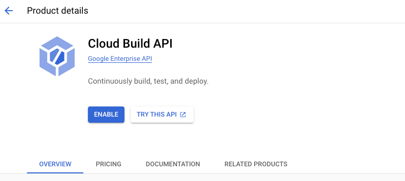
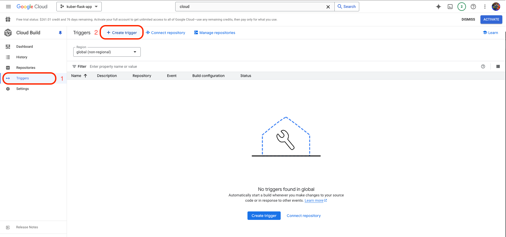
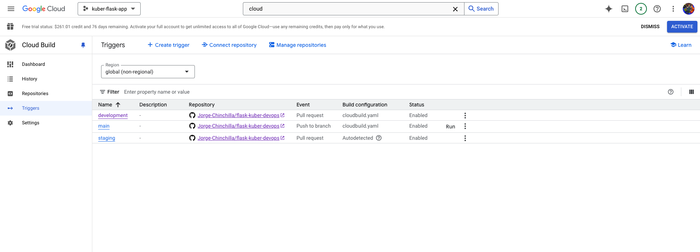
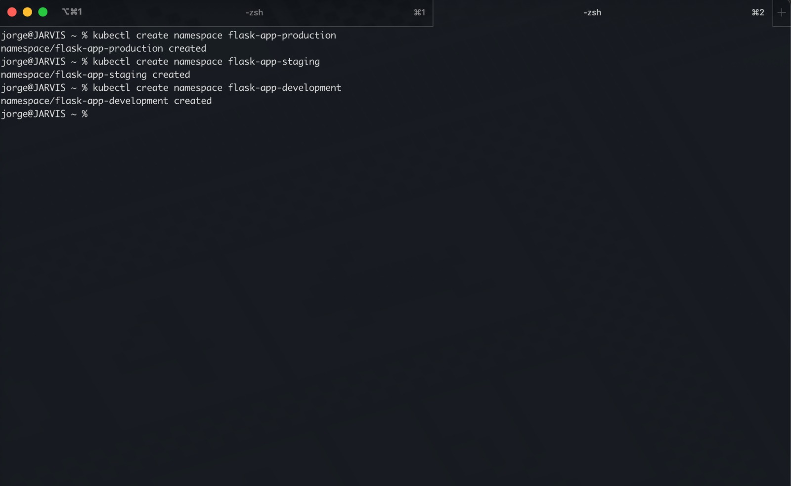
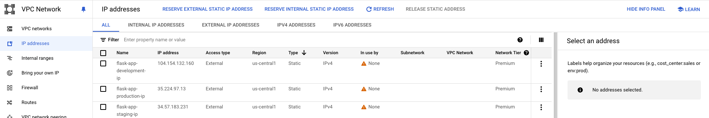

# Flask App to Kubernetes Engine
This repository is a step by step project on how to deploy a Flask Application to a Kubernetes cluster following DevOps 
best practices suck as CI/CD and basics of Infrastructure as Code using yaml files. 
---
## Scope
> Deploying a simple Flask Application to Google Kubernetes Engine, and expose it to https://[yourdomain].com
---
## What we'll be using:
* Github branching
* Docker
* Google Cloud
  * Google Kubernetes Engine
  * Cloudbuild
  * Artifact Registry
* Owned domain
---
## Guide

### Step 1:
Creating the GitHub repository with the development, staging and default main branches. To Prevent untested code to make its way into production, we'll require Pull requests via a repository Ruleset.

1. Create your GitHub repository
2. Create the `main`, `staging` and `development` branches.
3. Setup a Ruleset that requires a Pull Request for merging on the above mentioned branches  
4. Clone your repository locally to start the guide

### Step 2: Creating our test Flask App
The main focus of the project is to deploy a production ready web application using CI/CD and GKE (Google Kubernetes Engine in GCP). For this project, we are building a simple Flask app.
```
.
.
├── Dockerfile
├── README.md
├── app.py
├── requirements.txt
├── .gitignore
├── .dockerignore
├── static
│           └── styles.css
└── templates
    └── index.html
```

1. Ensure you clone your repository locally.
2. Create a branch named 'feature/flask-app-start' and checkout to it. You can use `git checkout -b feature/flask-app-start` to create and navigate to the branch locally.
2. Create the Dockerfile. .dockerignore, app.py, requirements.txt, styles.css and index.html files which build your containerized flask app. You can find the source code in this repository.
3. Test your app.
   - Ensure you have Docker installed and running on your system
   - Open your terminal and navigate to the root of your directory
   - Build your image with the command `docker build -t test-flask-image .`
     - You can list the images created with `docker images` command
   - Run your image in a new container with the command `docker run --name flask-app-container -p 5001:5000 test-flask-image`.
   - Go to localhost:5001 on your browser ensure your app is running as expected.
10. Commit and push your changes to the repository.
11. We haven't merged the changes from our `feature/flask-app-start` branch into the development branch. Let's create a pull request 
in GitHub to merge from `feature/flask-app-start` into development. We'll not go into depth with this step, but ensure
that after creating the PR, you merge the changes into the development branch.

### Step 3: Google Cloud Setup
The app will be deploy in kubernetes cluster in Google Cloud, to avoid charges to our credit cards, we will create an account with a 90 days trial and 300$ in credits.
All details are listed in the [Google Cloud Free Program](https://cloud.google.com/free/docs/free-cloud-features) documentation.
1. Creating your free account (summarized):
   - Login with a Google Account that has not been registered in Google Cloud
   - Follow the steps for enabling your Free Trial
   - Setup your billing information
5. Create a Project [Creating a Google Cloud project](https://developers.google.com/workspace/guides/create-project). Projects allow us to organize our cloud resources.
6. Search for the GKE Service 
7. Enable the Kubernetes Engine API 
8. Wait for a few minutes, then go to the Kubernetes Engine service again to create your cluster: 
9. On the creation screen, follow this steps:
   - Switch to *standard cluster* creation 
   - Set cluster name to "master-cluster" and Location type to Zonal as it is cheaper than regional. Consider Regional types for production deployments for High Availability. 
   - To reduce costs during this demo, click on the "default-pool" options in your left panel, then click on Nodes and change the machine type to **e2-micro** and Boot disk size to 20GB, this should change the estimated cost for the GKE cluster to ~97.34$ monthly.
10. Wait a few minutes for the cluster to create, and then click on the three dots to connect to the cluster. You can connect via the built in Cloud Shell, or setup the Google Cloud CLI on your machine ([Install the gcloud CLI](https://cloud.google.com/sdk/docs/install)).
11. If you setup the Google CLI, you might get the error "gke-gcloud-auth-plugin not found", if so, install it using the `  gcloud components install gke-gcloud-auth-plugin` command.

### Step 4: CI/CD Setup with Cloudbuild
In this step, we'll setup three triggers in Cloudbuild. Each trigger will be listening for PR checks in each branch of our repository, so that when something is merge
to a specific branch, the application will be built in its respective stage/environment.
1. Similar to how we setup the GKE cluster, search for the CloudBuild service in the search bar and enable its API.
2. Wait a few minutes, and once enabled, search for the service and access it.
3. Go to the triggers section in the left panel and create your trigger. We'll create a trigger for main/production, development and staging envs. 
4. Steps to create each trigger:
   - Name: \<branch-name\>
   - region: Global
   - Event: Pull request (We want to trigger the deployment when a pull request is merged into the branch)
   - Source: 1st gen for sake of this demo
   - Repository: Follow the prompts to connect your repository
   - Branch: ^\<branch-name\>$
   - Configuration: Cloud Build configuration file (yaml or json)
   - file location: /cloudbuild.yaml
   - Substitution Variables: [We'll be explained later]
     - _NAMESPACE = \<Environment-name\>
   - Service Account: Lets user the default compute service account for now.
5. You should end up with the following triggers: 
We'll now work on declaring our GKE infrastructure in a YAML file, and then we'll configure the cloudbuild.yaml so we can 
automate the deployments of new versions into development, staging and production.

### Step 5: Declaring and creating our infrastructure
It's time to build our environments in our GKE cluster so we can deploy our app through the different environments. We'll walk on a step by step guide on how to achieve this.
1. Create the namespaces for each environment in the GKE Cluster.
    - Create the namespaces via Cloud Shell or the GCloud CLI using the command `kubectl create namespace flask-app-<environment>`: 
2. Reserve 3 External Static IPs in Google Cloud, for each environment. 
3. Create a new branch feature/auto-deploy-base
4. Creating our `cloudbuild.yaml` file. You can find the file in this repository, and it was designed so it can use the substition variable
in the triggers to deploy infrastructure in a specific environment based on the branch of the pull request merged.
4. Create the `gke-development.yaml`, `gke-development.yaml`, and `gke-produciton.yaml` files.
5. Merge into development

Will continue...